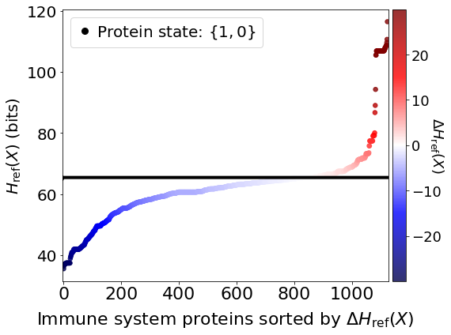
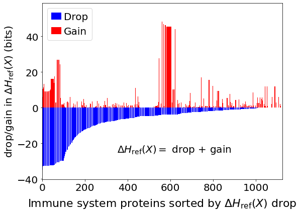

Computing protein expression efficacy
=====================================

**Computes the change in network relative entropy from viral PPIs after
setting immune system proteins, one at a time, to high abundance
{1,0}.**

.. code:: ipython3

    import os, sys
    import numpy as np
    import scipy as sp
    import pandas as pd
    import copy as copy
    from tqdm.notebook import tqdm
    import math
    import scipy.stats as st

    from CoRe import reader
    from CoRe.ncip import ncip
    from CoRe.BA_C import BA

    import importlib

    import networkx as nx
    import matplotlib.pyplot as plt
    import json

    from matplotlib import cm
    from matplotlib import rcParams
    import matplotlib.patches as patches

.. code:: ipython3

    data_directory = "./Examples/Immune_System"
    os.chdir(data_directory)

    edge_data = pd.read_pickle('Immune_System_medium-PPI-edges.pkl')
    node_data = pd.read_pickle('Immune_System_medium-PPI-nodes.pkl')

.. code:: ipython3

    remake_graph = False

    if remake_graph==False:
        netObj = ncip()
        netObj.load_graph('Immune_System-medium-PPI.gml')
    else:
        netObj = ncip()
        netObj.load_data(edge_data,node_data)
        netObj.make_graph()
        netObj.save_network(pathway_nametag,network_type)

**All immune system communication network proteins that have PPI with
SARS-CoV-2 proteins.**

.. code:: ipython3

    f = open('SARS_CoV2-Immune_System_interactions.json')
    SARS_nodes = json.load(f)
    f.close()

    all_sars_nodes = []

    for s in SARS_nodes.keys():
        all_sars_nodes += SARS_nodes[s]

    all_sars_nodes = list(set(all_sars_nodes))

    print(all_sars_nodes)

.. parsed-literal::

    ['RHOA', 'SLC27A2', 'PVR', 'ELOB', 'EIF4E2', 'CYB5R3', 'NLRX1', 'RAB14', 'ECSIT', 'AP2A2', 'CSNK2B', 'HECTD1', 'ERP44', 'IL17RA', 'ITGB1', 'RALA', 'RAB10', 'NEU1', 'IMPDH2', 'TOMM70', 'GGH', 'PTGES2', 'TBK1', 'RIPK1', 'RAB7A', 'ANO6', 'HMOX1', 'SLC44A2', 'NPC2', 'RNF41', 'RAB18', 'GOLGA7', 'ELOC', 'STOM', 'RAB5C', 'GLA']

**Specifying the reference state and construction of the global
transition matrix.**

.. code:: ipython3

    initial_state_type = 'maxEnt'

    errorname = '0.0'
    rho = float(errorname)

    input_bits = 1
    code_length = int(2**input_bits)

    max_entropy_state = (1.0/float(code_length))*np.ones(shape=(code_length,))

    low_state = np.zeros(shape=(code_length,))
    low_state[-1] = 1.0

    high_state = np.zeros(shape=(code_length,))
    high_state[0] = 1.0

    if initial_state_type=='high':
        initial_state = high_state
    elif initial_state_type=='low':
        initial_state = low_state
    else:
        initial_state = max_entropy_state

    print(high_state,low_state)

    netObj.construct_C(rho,h=input_bits,neglect_modules=[])
    node_list = list(netObj.G_d.nodes)

.. parsed-literal::

    [1. 0.] [0. 1.]

**Disconnect all drugs from the network.**

.. code:: ipython3

    netObj.disconnect_drug_nodes()

**Compute the reference stationary state of the network.**

.. code:: ipython3

    initial_network_state = np.zeros(shape=(netObj.C_sparse.shape[0],1))
    network_sources = {}

    for n in range(0,len(node_list)):
        initial_network_state[code_length*n:code_length*(n+1),0] = initial_state

    network_sources = []

    reference_final_state, steps = netObj.get_final_state(initial_network_state,[])
    reference_final_entropy = netObj.state_entropy(reference_final_state,[])
    print('Reference state relative entropy: ',reference_final_entropy)

.. parsed-literal::

    Reference state relative entropy:  0.0

**Set the SARS-CoV-2 nodes in the network to low abundance.**

.. code:: ipython3

    network_state = np.zeros(shape=(netObj.C_sparse.shape[0],1))
    network_sources = []

    for n in range(0,len(node_list)):
        network_state[code_length*n:code_length*(n+1),0] = initial_state

    for k in tqdm(SARS_nodes.keys()):
        for n in SARS_nodes[k]:
            try:
                i = node_list.index(n)

                network_state[netObj.code_length*i:netObj.code_length*(i+1),0] = low_state

                if i not in network_sources:
                    network_sources.append(i)
            except ValueError:
                pass

.. parsed-literal::

      0%|          | 0/17 [00:00<?, ?it/s]

**Relative entropy of the total network and number of steps to
stationary state.**

.. code:: ipython3

    final_state, steps = netObj.get_final_state(network_state,network_sources)
    SARSCoV2_entropy = netObj.state_entropy(final_state,network_sources)

**Compute stationary state of the network due to SARS-CoV-2 PPIs and
proteins.**

The proteins in the Reactome database were set to the state {1,0} to
compute the stationary state, and the subsequent change in the network
relative entropy.

.. code:: ipython3

    node_class = nx.get_node_attributes(netObj.G_d,"class")
    node_n = list(netObj.G_d.nodes())

    c = 0

    for i in range(0,len(node_n)):
        nn = node_n[i]
        if node_class[nn]=='EntityWithAccessionedSequence':
            relH = st.entropy(final_state[netObj.code_length*i:netObj.code_length*(i+1),0],max_entropy_state,base=2)

            if relH>0.01:
                c += 1

.. code:: ipython3

    all_sources = []

    for n in netObj.G_d.nodes(data=True):
        if n[1]['class']=='EntityWithAccessionedSequence' and n[0] not in all_sars_nodes:
            all_sources.append((n[0],netObj.G_d.in_degree(n[0])))

.. code:: ipython3

    df_H_with_proteins = pd.DataFrame()
    df_H_drop_and_gain = pd.DataFrame()

    df_H_with_proteins = pd.DataFrame([],columns=['Protein', 'Relative Entropy'])

    df_H_drop_and_gain = pd.DataFrame([],columns=['Protein', 'Drop', 'Gain'])

.. code:: ipython3

    for this_protein in tqdm(all_sources):
        s = this_protein[0]
        additional_source_nodes = [s]

        netObj.construct_C(rho,h=input_bits)
        netObj.disconnect_nodes('ChemicalDrug',additional_source_nodes)
        netObj.disconnect_nodes('ProteinDrug',additional_source_nodes)

        network_state = np.zeros(shape=(netObj.C_sparse.shape[0],1))
        network_sources = []

        for n in range(0,len(node_list)):
            network_state[code_length*n:code_length*(n+1),0] = initial_state

        for k in SARS_nodes.keys():
            for n in SARS_nodes[k]:
                try:
                    i = node_list.index(n)

                    network_state[netObj.code_length*i:netObj.code_length*(i+1),0] = low_state

                    network_sources.append(i)
                except ValueError:
                    pass

            for n in additional_source_nodes:
                try:
                    i = node_list.index(n)

                    network_state[netObj.code_length*i:netObj.code_length*(i+1),0] = high_state

                    network_sources.append(i)
                except ValueError:
                    pass

        this_state, steps = netObj.get_final_state(network_state,network_sources)
        H_with_proteins = netObj.state_entropy(this_state,network_sources)
        H_drop, H_gain = netObj.entropy_drop_and_rise(this_state,final_state,reference_final_state,network_sources)

        df_temp = pd.DataFrame([[this_protein[0],H_with_proteins]],columns=['Protein','Relative Entropy'])
        df_H_with_proteins = pd.concat([df_H_with_proteins,df_temp],sort=False,ignore_index=True)

        df_temp = pd.DataFrame([[this_protein[0],H_drop,H_gain]],columns=['Protein', 'Drop', 'Gain'])
        df_H_drop_and_gain = pd.concat([df_H_drop_and_gain,df_temp],sort=False,ignore_index=True)

.. parsed-literal::

      0%|          | 0/1122 [00:00<?, ?it/s]

.. code:: ipython3

    try:
        os.chdir('./counter_entropic_shift')
    except OSError:
        os.mkdir('./counter_entropic_shift')
        os.chdir('./counter_entropic_shift')

.. code:: ipython3

    df_H_with_proteins = df_H_with_proteins.sort_values(by=['Relative Entropy'],ignore_index=True)

.. code:: ipython3

    #df_temp = pd.DataFrame([['Ref',SARSCoV2_entropy]],columns=['Protein','Relative Entropy'])
    #df_H_with_proteins = pd.concat([df_temp,df_H_with_proteins],sort=False,ignore_index=True)

    #df_H_with_proteins.to_csv('high_all_protein_shifts-'+initial_state_type+'.csv',index=False)

    df_H_drop_and_gain = df_H_drop_and_gain.sort_values(by=['Drop'],ascending=True,ignore_index=True)
    df_H_drop_and_gain.to_csv('split_all_high_protein_shifts-'+initial_state_type+'.csv',index=False)

.. code:: ipython3

    c_high = df_H_with_proteins['Relative Entropy'][1:] - SARSCoV2_entropy
    r_min, r_max = np.min(c_high), np.max(c_high)
    max_r = max(abs(r_min),abs(r_max))
    v_min, v_max = -abs(r_min), abs(r_min)

**Immune system proteins ranked by** :math:`\Delta H_{\mathrm{ref}}(X).`

.. code:: ipython3

    all_tick_names = df_H_with_proteins['Protein'].to_list()[1:]
    data_size = len(all_tick_names)
    x = np.linspace(1,data_size,data_size)

    tick_names = [n.split(' [')[0] for n in all_tick_names]

    fig, ax = plt.subplots(figsize=(8,6))

    plt.scatter(x,df_H_with_proteins['Relative Entropy'][1:],c=c_high,cmap=cm.seismic,vmin=v_min,vmax=v_max,marker='o',alpha=0.8,s=30)
    plt.plot(x,SARSCoV2_entropy*np.ones(shape=x.shape),color='black',markersize=0,linewidth=4,alpha=1.0)
    plt.plot(-10,df_H_with_proteins['Relative Entropy'][0],lw=0,ms=8,marker='o',label=r'Protein state: $\{1,0\}$',c='black')

    plt.xlim(-3,data_size+5)

    plt.ylabel(r'$H_{\mathrm{ref}}(X)$ (bits)',size=20)
    plt.tick_params(axis='y',labelsize=20)
    plt.tick_params(axis='x',labelsize=22)

    plt.xlabel('Immune system proteins sorted by $\Delta H_{\mathrm{ref}}(X)$',size=22,labelpad=10)

    plt.legend(frameon=True,fontsize=20,handlelength=1.0,handletextpad=0.25,loc='upper left')

    cbar = plt.colorbar(fraction=0.05,pad=0.01)

    cbar.set_label(r'$\Delta H_{\mathrm{ref}}(X)$',fontsize=18,rotation=-90,labelpad=5)
    cbar.ax.tick_params(labelsize=18)

    plt.tight_layout()
    plt.show()

**Immune system proteins ranked by the drop component of** :math:`\Delta H_{\mathrm{ref}}(X).`

.. code:: ipython3

    fig, ax = plt.subplots(figsize=(8,6))

    plt.bar(x,df_H_drop_and_gain['Drop'],color='Blue',label='Drop')
    plt.bar(x,df_H_drop_and_gain['Gain'],color='Red',label='Gain')
    plt.xlim(-0.5,len(df_H_drop_and_gain['Protein'])+0.5)

    plt.ylabel(r'drop/gain in $\Delta H_{\mathrm{ref}}(X)$ (bits)',size=20)
    plt.tick_params(axis='x',labelsize=20)
    plt.tick_params(axis='y',labelsize=20)
    plt.xlabel(r'Immune system proteins sorted by $\Delta H_{\mathrm{ref}}(X)$ drop',size=22,labelpad=10)
    plt.text(350,-25,r'$\Delta H_{\mathrm{ref}}(X)=$ drop + gain',fontsize=20)
    plt.legend(frameon=True,fontsize=20,handlelength=1.0,handletextpad=0.25,loc='upper left')

    plt.tight_layout()
    plt.show()

