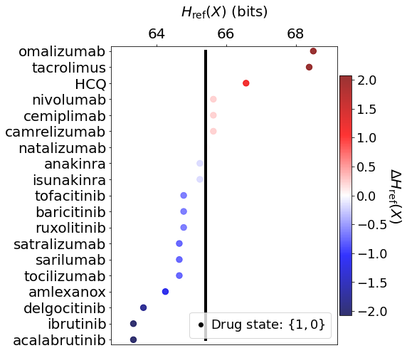
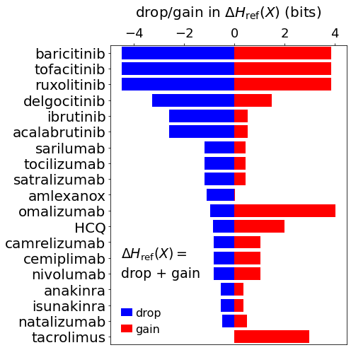

Drug efficacy
=============

**Computes the change in network relative entropy from viral PPIs after
setting drug state to high abundance**

.. code:: ipython3

    import os, sys
    import numpy as np
    import scipy as sp
    import pandas as pd
    import copy as copy
    from tqdm.notebook import tqdm
    import math
    import scipy.stats as st
    
    from CoRe import reader
    from CoRe.ncip import ncip
    from CoRe.BA_C import BA
    
    import importlib
    
    import networkx as nx
    import matplotlib.pyplot as plt
    import json
    
    from matplotlib import cm
    from matplotlib import rcParams
    import matplotlib.patches as patches

.. code:: ipython3

    data_directory = "./Examples/Immune_System"
    os.chdir(data_directory)
    
    edge_data = pd.read_pickle('Immune_System_medium-PPI-edges.pkl')
    node_data = pd.read_pickle('Immune_System_medium-PPI-nodes.pkl')

.. code:: ipython3

    remake_graph = False
    
    if remake_graph==False:
        netObj = ncip()
        netObj.load_graph('Immune_System-medium-PPI.gml')
    else:
        netObj = ncip()
        netObj.load_data(edge_data,node_data)
        netObj.make_graph()
        netObj.save_network(pathway_nametag,network_type)

**Drugs that are part of the immune system in the Reactome database**

.. code:: ipython3

    drugs = []
    drug_names = []
    
    all_nodes = netObj.G_d.nodes(data=True)
    
    for n in netObj.G_d.nodes(data=True):
        if 'Drug' in n[1]['class'] and 'lat' not in n[1]['name'] and n[0] not in drug_names:
            print(n[0],n[1]['name'],n[1]['class'])
            drugs.append((n[0],n[1]['class'],n[1]['name']))
            drug_names.append(n[0])

.. parsed-literal::

    R-ALL-9679737 natalizumab [extracellular region] ProteinDrug
    R-ALL-9681784 anakinra [extracellular region] ProteinDrug
    R-ALL-9681764 isunakinra [extracellular region] ProteinDrug
    R-ALL-9678829 baricitinib [cytosol] ChemicalDrug
    R-ALL-9678779 tofacitinib [cytosol] ChemicalDrug
    R-ALL-9678901 ibrutinib [cytosol] ChemicalDrug
    R-ALL-9678960 acalabrutinib [cytosol] ChemicalDrug
    R-ALL-9678786 ruxolitinib [cytosol] ChemicalDrug
    R-ALL-9715049 sarilumab [extracellular region] ProteinDrug
    R-ALL-9715070 satralizumab [extracellular region] ProteinDrug
    R-ALL-9681301 tocilizumab [extracellular region] ProteinDrug
    R-ALL-9679801 amlexanox [cytosol] ChemicalDrug
    R-ALL-9724689 omalizumab [extracellular region] ProteinDrug
    R-ALL-9678991 tacrolimus [cytosol] ChemicalDrug
    R-ALL-9679471 camrelizumab [extracellular region] ProteinDrug
    R-ALL-9679434 cemiplimab [extracellular region] ProteinDrug
    R-ALL-9679411 nivolumab [extracellular region] ProteinDrug
    R-ALL-9678628 HCQ [cytosol] ChemicalDrug
    R-ALL-9717004 delgocitinib [cytosol] ChemicalDrug

**All immune system communication network proteins that have PPI with
SARS-CoV-2 proteins**

.. code:: ipython3

    f = open('SARS_CoV2-Immune_System_interactions.json')
    SARS_nodes = json.load(f)
    f.close()
    
    all_sars_nodes = []
    
    for s in SARS_nodes.keys():
        all_sars_nodes += SARS_nodes[s]
        
    all_sars_nodes = list(set(all_sars_nodes))
    
    print(all_sars_nodes)

.. parsed-literal::

    ['AP2A2', 'CYB5R3', 'PVR', 'ELOC', 'NLRX1', 'NEU1', 'RHOA', 'SLC27A2', 'ELOB', 'HMOX1', 'HECTD1', 'RAB10', 'RALA', 'RAB5C', 'RAB7A', 'SLC44A2', 'CSNK2B', 'NPC2', 'RAB18', 'ITGB1', 'ERP44', 'RIPK1', 'IL17RA', 'IMPDH2', 'PTGES2', 'GOLGA7', 'STOM', 'EIF4E2', 'ANO6', 'GLA', 'ECSIT', 'RAB14', 'TBK1', 'GGH', 'RNF41', 'TOMM70']

**Specifying the reference state and construction of the global
transition matrix**

.. code:: ipython3

    initial_state_type = 'maxEnt'
    
    errorname = '0.0'
    rho = float(errorname)
    
    input_bits = 1
    code_length = int(2**input_bits)
    
    max_entropy_state = (1.0/float(code_length))*np.ones(shape=(code_length,))
    
    low_state = np.zeros(shape=(code_length,))
    low_state[-1] = 1.0
    
    high_state = np.zeros(shape=(code_length,))
    high_state[0] = 1.0
    
    if initial_state_type=='high':
        initial_state = high_state
    elif initial_state_type=='low':
        initial_state = low_state
    else:
        initial_state = max_entropy_state
    
    print(high_state,low_state)
    
    netObj.construct_C(rho,h=input_bits,neglect_modules=[])
    node_list = list(netObj.G_d.nodes)

.. parsed-literal::

    [1. 0.] [0. 1.]

**Disconnect all drugs from the network initially**

.. code:: ipython3

    netObj.disconnect_drug_nodes()

**Compute the reference stationary state of the network**

.. code:: ipython3

    initial_network_state = np.zeros(shape=(netObj.C_sparse.shape[0],1))
    network_sources = {}
    
    for n in range(0,len(node_list)):
        initial_network_state[code_length*n:code_length*(n+1),0] = initial_state
        
    network_sources = []
    
    reference_final_state, steps = netObj.get_final_state(initial_network_state,[])
    reference_final_entropy = netObj.state_entropy(reference_final_state,[])
    print('Reference state relative entropy: ',reference_final_entropy)

.. parsed-literal::

    Reference state relative entropy:  0.0

**Set the SARS-CoV-2 nodes in the network to low abundance**

.. code:: ipython3

    network_state = np.zeros(shape=(netObj.C_sparse.shape[0],1))
    network_sources = []
    
    for n in range(0,len(node_list)):
        network_state[code_length*n:code_length*(n+1),0] = initial_state
    
    for k in tqdm(SARS_nodes.keys()):
        for n in SARS_nodes[k]:
            try:
                i = node_list.index(n)
    
                network_state[netObj.code_length*i:netObj.code_length*(i+1),0] = low_state
    
                if i not in network_sources:
                    network_sources.append(i)
            except ValueError:
                pass

.. parsed-literal::

      0%|          | 0/17 [00:00<?, ?it/s]

**Compute stationary state of the network due to SARS-CoV-2 PPIs**

.. code:: ipython3

    final_state, steps = netObj.get_final_state(network_state,network_sources)
    SARSCoV2_entropy = netObj.state_entropy(final_state,network_sources,reference_final_state)

**Compute stationary state of the network due to SARS-CoV-2 PPIs and
drugs**

The drugs in the Reactome database were set to the state {1,0} to
compute the stationary state, and the subsequent change in the network
relative entropy.

.. code:: ipython3

    df_H_with_drugs = pd.DataFrame()
    df_H_drop_and_gain = pd.DataFrame()
    
    df_H_with_drugs = pd.DataFrame([],columns=['Drug','Relative Entropy','Drug Type'])
    
    df_H_drop_and_gain = pd.DataFrame([],columns=['Drug','Drop', 'Gain','Drug Type'])

.. code:: ipython3

    for this_drug in tqdm(drugs):
        s = this_drug[0]
        additional_source_nodes = [s]
        
        netObj.load_graph('Immune_System-medium-PPI.gml')
        netObj.disconnect_drug_nodes(skip=s)
        
        netObj.construct_C(rho,h=input_bits)
        
        network_state = np.zeros(shape=(netObj.C_sparse.shape[0],1))
        network_sources = []
        
        for n in range(0,len(node_list)):
            network_state[code_length*n:code_length*(n+1),0] = initial_state
    
        for k in SARS_nodes.keys():
            for n in SARS_nodes[k]:
                try:
                    i = node_list.index(n)
    
                    network_state[netObj.code_length*i:netObj.code_length*(i+1),0] = low_state
    
                    network_sources.append(i)
                except ValueError:
                    pass
    
            for n in additional_source_nodes:
                try:
                    i = node_list.index(n)
    
                    network_state[netObj.code_length*i:netObj.code_length*(i+1),0] = high_state
    
                    network_sources.append(i)
                except ValueError:
                    pass
            
        this_state, steps = netObj.get_final_state(network_state,network_sources)
        H_with_drugs = netObj.state_entropy(this_state,network_sources,reference_final_state)
        H_drop, H_gain = netObj.entropy_drop_and_gain(this_state,final_state,reference_final_state,network_sources)
        
        drug_name = this_drug[2].split(' [')[0]
        
        df_temp = pd.DataFrame([[drug_name,H_with_drugs,this_drug[1]]],columns=['Drug','Relative Entropy','Drug Type'])
        df_H_with_drugs = pd.concat([df_H_with_drugs,df_temp],sort=False,ignore_index=True)
    
        df_temp = pd.DataFrame([[drug_name,H_drop,H_gain,this_drug[1]]],columns=['Drug', 'Drop', 'Gain','Drug Type'])
        df_H_drop_and_gain = pd.concat([df_H_drop_and_gain,df_temp],sort=False,ignore_index=True)

.. parsed-literal::

      0%|          | 0/19 [00:00<?, ?it/s]

.. code:: ipython3

    try:
        os.chdir('./counter_entropic_shift')
    except OSError:
        os.mkdir('./counter_entropic_shift')
        os.chdir('./counter_entropic_shift')

.. code:: ipython3

    df_H_with_drugs = df_H_with_drugs.sort_values(by=['Relative Entropy'],ignore_index=True)
    
    all_tick_names = df_H_with_drugs['Drug'].to_list()
    tick_names = [n.split(' [')[0] for n in all_tick_names]
    data_size = len(tick_names)
    x = np.linspace(1,data_size,data_size)

.. code:: ipython3

    df_temp = pd.DataFrame([['Ref',SARSCoV2_entropy,'None']],columns=['Protein','Relative Entropy','Drug Type'])
    df_H_with_drugs = pd.concat([df_temp,df_H_with_drugs],sort=False,ignore_index=True)
    
    df_H_with_drugs.to_csv('high_all_drug_shifts-'+initial_state_type+'.csv',index=False)
    
    df_H_drop_and_gain = df_H_drop_and_gain.sort_values(by=['Drop'],ascending=False,ignore_index=True)
    df_H_drop_and_gain.to_csv('split_all_drug_shifts-'+initial_state_type+'.csv',index=False)

**Setup colorbar scale**

.. code:: ipython3

    c_high = df_H_with_drugs['Relative Entropy'].to_numpy()[1:] - SARSCoV2_entropy
    r_min, r_max = np.min(c_high), np.max(c_high)
    max_r = max(abs(r_min),abs(r_max))
    v_min, v_max = -abs(r_min), abs(r_min)

**Plot drugs ranked by their $
:raw-latex:`\Delta `H_{:raw-latex:`\mathrm{ref}`}(X) $**

.. code:: ipython3

    fig, ax = plt.subplots(figsize=(8,7))
    
    plt.scatter(df_H_with_drugs['Relative Entropy'].to_numpy()[1:],x,c=c_high,cmap=cm.seismic,vmin=v_min,vmax=v_max,marker='o',alpha=0.8,s=70)
    plt.plot(SARSCoV2_entropy*np.ones(shape=x.shape),x,color='black',markersize=0,linewidth=4,alpha=1.0)
    plt.ylim(0.7,data_size+0.3)
    
    ax.set_yticks(np.arange(1,data_size+1))
    ax.set_yticklabels(tick_names,fontsize=14,rotation=0)
    
    plt.xlabel(r'$H_{\mathrm{ref}}(X)$ (bits)',size=20,labelpad=15)
    plt.tick_params(axis='both',labelsize=20)
    
    ax.xaxis.tick_top()
    ax.xaxis.set_label_position('top') 
    
    plt.xlim(0.99*np.min(df_H_with_drugs['Relative Entropy']),1.01*np.max(df_H_with_drugs['Relative Entropy']))
    
    plt.plot(-10,SARSCoV2_entropy,lw=0,ms=6,marker='o',label=r'Drug state: $\{1,0\}$',c='black')
    
    plt.legend(loc='lower right',frameon=True,fontsize=18,handlelength=1.0,handletextpad=0.25)
    
    cbar = plt.colorbar(fraction=0.05,pad=0.01)
    
    cbar.set_label(r'$\Delta H_{\mathrm{ref}}(X)$',fontsize=20,rotation=-90,labelpad=20)
    cbar.ax.tick_params(labelsize=18)
    
    plt.tight_layout()
    
    plt.show()

**Plot drugs ranked by their $
:raw-latex:`\Delta `H_{:raw-latex:`\mathrm{ref}`}(X) $ drop component**

.. code:: ipython3

    fig, ax = plt.subplots(figsize=(7,7))
    
    plt.barh(x,df_H_drop_and_gain['Drop'],color='Blue',label='drop')
    plt.barh(x,df_H_drop_and_gain['Gain'],color='Red',label='gain')
    
    plt.xlabel(r'drop/gain in $\Delta H_{\mathrm{ref}}(X)$ (bits)',size=20,labelpad=15)
    
    plt.tick_params(axis='x',labelsize=20,rotation=0)
    plt.tick_params(axis='y',labelsize=20)
    
    plt.ylim(0.5,len(df_H_drop_and_gain['Drug'])+0.5)
    plt.tick_params(axis='x',labelsize=18)
    plt.legend(frameon=False,fontsize=16,handlelength=1.0,handletextpad=0.25)
    plt.text(-4.5,6,r'$\Delta H_{\mathrm{ref}}(X)=$',fontsize=19)
    plt.text(-4.5,4.75,r'drop + gain',fontsize=19)
    
    ax.xaxis.tick_top()
    ax.xaxis.set_label_position('top') 
    
    ax.set_yticks(np.arange(1,data_size+1))
    ax.set_yticklabels(df_H_drop_and_gain['Drug'],fontsize=20,rotation=0)
    
    plt.tight_layout()
    
    plt.show()

