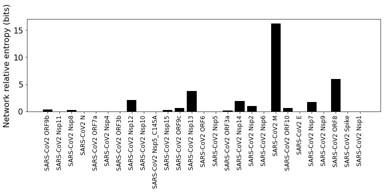

Information transfer due to viral PPI
=====================================

The SARS-CoV-2 and human protein interactions are treated as information
sources. Each edge in the pathway network is treated as a binary
symmetric information channel. Initial state of the network is all
network nodes at maximum entropy state. The information source nodes are
fixed at low entropy state. Information propagates through the network
edges (information channels) to the other nodes (receiver nodes) of the
network. We use relative entropy of the receiver nodes as a measure of
impact of the SARS-CoV-2 proteins.

.. code:: ipython3

    import os, sys
    import numpy as np
    import scipy as sp
    import pandas as pd
    import copy as copy
    from tqdm.notebook import tqdm
    import math
    import scipy.stats as st
    
    from CoRe import reader
    from CoRe.ncip import ncip
    from CoRe.BA_C import BA
    
    import importlib
    
    import networkx as nx
    import matplotlib.pyplot as plt
    import json

.. code:: ipython3

    current_directory = os.getcwd()
    
    data_directory = current_directory + "/Examples"
    os.chdir(data_directory)
    
    f = open('SARS_CoV2-interactions.json')
    all_SARS_nodes = json.load(f)
    f.close()
    
    sars_pnames = list(all_SARS_nodes)

.. code:: ipython3

    selected_pathway = 'Immune System'
    pathway_nametag = selected_pathway.replace(' ','_')
    
    network_type = 'medium-PPI'
    
    data_directory = current_directory + "/Examples/" + pathway_nametag
    os.chdir(data_directory)
    
    edge_data = pd.read_pickle(pathway_nametag+'_'+network_type+'-edges.pkl')
    node_data = pd.read_pickle(pathway_nametag+'_'+network_type+'-nodes.pkl')

.. code:: ipython3

    remake_graph = False
    
    if remake_graph==False:
        netObj = ncip()
        netObj.load_graph(pathway_nametag+"-"+network_type+".gml")
    else:
        netObj = ncip()
        netObj.load_data(edge_data,node_data)
        netObj.make_graph()
        netObj.save_network(pathway_nametag,network_type)

.. code:: ipython3

    #netObj.write_nodes_and_edges(filetag=pathway_nametag)

.. code:: ipython3

    f = open('SARS_CoV2-'+pathway_nametag+'_interactions.json')
    SARS_nodes = json.load(f)
    f.close()

**Construction of the information channel model for the network.**

:math:`\rho` is the communication error for each edge. If a node
receives input from multiple edges, the receiver state is the mean of
the individual output states. The default channel type is a binary
symmetric channel as defined in `Elements of information
theory <https://books.google.com/books?hl=en&lr=&id=VWq5GG6ycxMC&oi=fnd&pg=PR15&ots=bZ6fK1WaYP&sig=g2JGYtx-EFJKhoFBG-THaWLfKY0#v=onepage&q&f=false>`__.

.. code:: ipython3

    initial_state_type = 'maxEnt'
    
    errorname = '0.0'
    rho = float(errorname)
    
    input_bits = 1
    code_length = int(2**input_bits)
    
    max_entropy_state = (1.0/float(code_length))*np.ones(shape=(code_length,))
    
    low_state = np.zeros(shape=(code_length,))
    low_state[-1] = 1.0
    
    high_state = np.zeros(shape=(code_length,))
    high_state[0] = 1.0
    
    if initial_state_type=='high':
        initial_state = high_state
    elif initial_state_type=='low':
        initial_state = low_state
    else:
        initial_state = max_entropy_state
    
    print(high_state,low_state)
    
    netObj.construct_C(rho,h=input_bits,neglect_modules=[])
    node_list = list(netObj.G_d.nodes)

.. parsed-literal::

    [1. 0.] [0. 1.]

**Initial and boundary conditions for information propagation**

The state of each node is define by the binary probability state
:math:`\{P(n=1),P(n=0)\}`, where the abundance (or copy number) the
physical entity (n) is coarse-grained into a binary variable high (1) or
low (0). The maximum entropy state for each node is :math:`\{0.5,0.5\}`.
We set every node in the network initially at the maximum entropy state.

We assume that direct interaction with SARS-CoV-2 proteins reduces the
effective abundance of the associated network nodes, so we set the state
of these nodes at :math:`\{0,1\}`. Additionally, we set the state of
ATP, ADP, and Pi at the maximum entropy state :math:`\{0.5,0.5\}`.

.. code:: ipython3

    additional_source_nodes = []#['UBE2L6']#["R-ALL-139836","R-ALL-196180","R-ALL-113592","R-ALL-29370","R-ALL-29358","R-ALL-113582","R-ALL-29372"]

.. code:: ipython3

    netObj.disconnect_drug_nodes()

.. code:: ipython3

    #netObj.disconnect_nodes('ChemicalDrug',additional_source_nodes)
    #netObj.disconnect_nodes('ProteinDrug',additional_source_nodes)
    #netObj.disconnect_nodes('SimpleEntity',additional_source_nodes)

.. code:: ipython3

    topological_source_count = 0
    
    for nG in netObj.G_d.nodes():
        if netObj.G_d.in_degree(nG)==0:
            topological_source_count += 1
            
    print(topological_source_count)
    
    print(len(node_list),len(netObj.G_d.nodes()))

.. parsed-literal::

    89
    3030 3030

.. code:: ipython3

    initial_network_state = np.zeros(shape=(netObj.C_sparse.shape[0],1))
    network_sources = {}
    
    for n in range(0,len(node_list)):
        initial_network_state[code_length*n:code_length*(n+1),0] = initial_state
        
    network_sources = []
    
    reference_final_state, steps = netObj.get_final_state(initial_network_state,[])
    reference_final_entropy = netObj.state_entropy(reference_final_state,[])
    print('Reference state relative entropy: ',reference_final_entropy)

.. parsed-literal::

    Reference state relative entropy:  0.0

.. code:: ipython3

    network_state = {}
    network_sources = {}
    
    for k in tqdm(SARS_nodes.keys()):
        network_state[k] = np.zeros(shape=(netObj.C_sparse.shape[0],1))
        
        for n in range(0,len(node_list)):
            network_state[k][code_length*n:code_length*(n+1),0] = initial_state
        
        network_sources[k] = []
        
        for n in SARS_nodes[k]:
            try:
                i = node_list.index(n)
    
                network_state[k][netObj.code_length*i:netObj.code_length*(i+1),0] = low_state
    
                network_sources[k].append(i)
            except ValueError:
                pass
            
        for n in additional_source_nodes:
            try:
                i = node_list.index(n)
    
                network_state[k][netObj.code_length*i:netObj.code_length*(i+1),0] = high_state
    
                network_sources[k].append(i)
            except ValueError:
                pass
            
        print(k,len(network_sources[k]),len(node_list)-len(network_sources[k])-topological_source_count)

.. parsed-literal::

      0%|          | 0/17 [00:00<?, ?it/s]

.. parsed-literal::

    SARS-CoV2 ORF9b 1 2940
    SARS-CoV2 Nsp8 1 2940
    SARS-CoV2 N 0 2941
    SARS-CoV2 Nsp12 1 2940
    SARS-CoV2 Nsp10 0 2941
    SARS-CoV2 Nsp15 1 2940
    SARS-CoV2 ORF9c 2 2939
    SARS-CoV2 Nsp13 1 2940
    SARS-CoV2 ORF3a 1 2940
    SARS-CoV2 Nsp14 1 2940
    SARS-CoV2 Nsp2 1 2940
    SARS-CoV2 M 1 2940
    SARS-CoV2 ORF10 2 2939
    SARS-CoV2 E 0 2941
    SARS-CoV2 Nsp7 2 2939
    SARS-CoV2 ORF8 4 2937
    SARS-CoV2 Spike 0 2941

**Relative entropy of the total network and number of steps to
stationary state.**

.. code:: ipython3

    entropy_data = pd.DataFrame(columns=['SARS-CoV-2 protein','Entropy (bits)','Steps'])
    final_state = {}
    final_entropy = {}
    
    try:
        os.chdir(data_directory+'/final_network_state')
    except OSError:
        os.mkdir(data_directory+'/final_network_state')
        os.chdir(data_directory+'/final_network_state')
    
    #for k in tqdm(SARS_nodes.keys()):
    for k in tqdm(sars_pnames):
        try:
            final_state[k], steps = netObj.get_final_state(network_state[k],network_sources[k])
            #final_entropy[k] = reference_final_entropy - netObj.state_entropy(final_state[k],network_sources[k])
            final_entropy[k] = netObj.state_entropy(final_state[k],network_sources[k],reference_final_state)
            
            df_temp = pd.DataFrame([[k,final_entropy[k],steps]],columns=['SARS-CoV-2 protein','Entropy (bits)','Steps'])
            
            entropy_data = pd.concat([entropy_data,df_temp],sort=False)
            
        except KeyError:
            final_state[k] = reference_final_state
            final_entropy[k] = 0.0
            
            df_temp = pd.DataFrame([[k,0.0,0.0]],columns=['SARS-CoV-2 protein','Entropy (bits)','Steps'])
            
            entropy_data = pd.concat([entropy_data,df_temp],sort=False)
            
    output_filename = initial_state_type+'-'+pathway_nametag+'_'+network_type+'_'+'relative_entropy-'+errorname+'.csv'
    
    entropy_data.to_csv(output_filename,index=None)
    os.chdir(data_directory)

.. parsed-literal::

      0%|          | 0/27 [00:00<?, ?it/s]

.. code:: ipython3

    print('\033[1m'+'Relative entropy of the network induced by the interaction with the SARS-CoV-2 protiens')
    
    fig = plt.figure(figsize=(11,5))
    plt.bar(entropy_data['SARS-CoV-2 protein'].to_numpy(),entropy_data['Entropy (bits)'].to_numpy(),color='black')
    #plt.yscale('log')
    #plt.ylim(0,20)
    plt.ylabel('Network relative entropy (bits)',size=16)
    plt.tick_params(axis='y',labelsize=16)
    plt.tick_params(axis='x',labelsize=12,rotation=90)
    
    plt.tight_layout()

.. parsed-literal::

    Relative entropy of the network induced by the interaction with the SARS-CoV-2 protiens

.. code:: ipython3

    node_list = netObj.G_d.nodes.data()
    
    total_genomic_entities = np.sum([x[1]['sequenced'] for x in node_list])
    
    genome_indices = [i for x,i in zip(node_list,range(0,len(node_list))) if x[1]['sequenced']!=0]
    
    print(total_genomic_entities,len(genome_indices))

.. parsed-literal::

    1131 1131

**Identify reference gene products that receive information about the
SARS-CoV-2 proteins.**

We use relative entropy with respect to the maximum entropy state as a
measure of the amount of information received by a network node,
:math:`H_M(n)=\sum_{k\in\{0,1\}} P(n=k)\log_2 P(n=k)/0.5`. The nodes
that have relative entropy above a threshold, :math:`H_M(n)\geq \alpha`,
are identified as receiving considerable amount of information. We chose
:math:`\alpha=0.1` bits because we found in experimental measurements of
gene expression data, it is challenging to measure the mutual
information with a precision higher than 0.1 bits.

.. code:: ipython3

    relH_threshold = 1e-2
    
    local_entropies = {}
    local_entropies_mat = np.zeros(shape=(total_genomic_entities,len(list(SARS_nodes.keys()))))
    max_entropy_state = np.array([0.5,0.5])
        
    j = 0
    
    for k in SARS_nodes.keys():
        local_entropies[k] = np.zeros(shape=(total_genomic_entities,))
        
        for i in range(0,len(genome_indices)):
            gen_i = genome_indices[i]
            
            if len(network_sources[k])>0 and gen_i not in network_sources[k]:
                this_state = final_state[k][netObj.code_length*gen_i:netObj.code_length*(gen_i+1),0]
                ref_state = reference_final_state[netObj.code_length*gen_i:netObj.code_length*(gen_i+1),0]
                
                local_entropies[k][i] = st.entropy(this_state,ref_state,base=2)
                
                if local_entropies[k][i]<relH_threshold:
                    local_entropies[k][i] = 0.0
            
        local_entropies_mat[:,j] = local_entropies[k]
        
        j += 1

**Identify reference gene products that have relative entropy higher
than the threshold.**

.. code:: ipython3

    n_names = [x[0] for x in node_list]
    gen_names = []
    
    for i in genome_indices:
        gen_names.append(n_names[i])

Drop SARS-CoV-2 proteins that cause lower than threshold relative
entropy to reference gene products.

.. code:: ipython3

    df = pd.DataFrame(local_entropies_mat,columns=list(SARS_nodes.keys()))
    df.insert(0,"node_index",genome_indices)
    df.insert(0,"node_ids",gen_names)
    
    arr = df.to_numpy()
    
    zero_r_idx, zero_c_names = [], []
    
    for i in range(0,arr.shape[0]):
        if np.sum(arr[i,2:])==0:
            zero_r_idx.append(i)
            
    c_names = list(df)
    
    for j in range(0,arr.shape[1]):
        if np.sum(arr[:,j])==0:
            zero_c_names.append(c_names[j])
    
    df_reduced1 = df.drop(zero_r_idx)
    df_reduced = df_reduced1.drop(zero_c_names,axis=1)
    
    os.chdir(data_directory)
    
    df_reduced.to_csv(initial_state_type+'-'+'SARS_CoV2_'+pathway_nametag+'_'+network_type+'_affected_genes'+errorname+'.csv',index=None)

