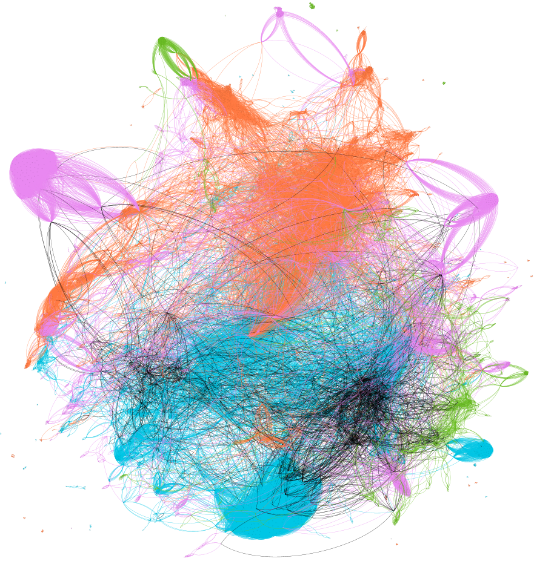

.. CoRe documentation master file, created by
   sphinx-quickstart on Sat Jul  2 17:19:44 2022.
   You can adapt this file completely to your liking, but it should at least
   contain the root `toctree` directive.

Welcome to CoRe's documentation!
=================================

**Co**\ mmunication through the **Re**\ actome and Interactome (CoRe) is an open-source scientific software to model human biological pathways
as information transferring networks. CoRe uses the `Reactome <https://reactome.org>`_ and the `Interactome <http://interactome.dfci.harvard.edu/H_sapiens/>`_ databases
to construct communication network models for human biology.

CoRe also uses the gene sets from the c5 collection in the `MSigDB <https://www.gsea-msigdb.org/gsea/msigdb/>`_ database to identify the significant biological processes using
Gene Ontology over-representation analysis.

This version of CoRe computes the information transfer in the immune system due to interactions with SARS-CoV-2 proteins.

:Author:
  `Swarnavo Sarkar <https://swarnavosarkar.com>`_

:Download:
 `github.com/sarkar-s/CoRe <https://github.com/sarkar-s/CoRe.git>`_

:References:
 If you are using any part of **CoRe**, please cite, `S. Sarkar, Communication network model of the immune system identifies the impact of interactions with SARS-CoV-2 proteins, arXiv (2022) <https://doi.org/10.48550/arXiv.2208.06355>`_

:Website:
  `swarnavosarkar.com <https://swarnavosarkar.com>`_

.. toctree::
   :maxdepth: 3
   :caption: Contents:

   Construct_network.ipynb
   Add-human_PPI.ipynb
   SARS-CoV-2_human_PPI.ipynb
   Information_transfer.ipynb
   Communicated_Proteins.ipynb
   communicated_ORA.ipynb
   Drug_efficacy.ipynb
   Controlled_protein_expression_efficacy.ipynb
   ncip
   fnGO
   dependencies

Indices and tables
==================

* :ref:`genindex`
* :ref:`modindex`
* :ref:`search`
